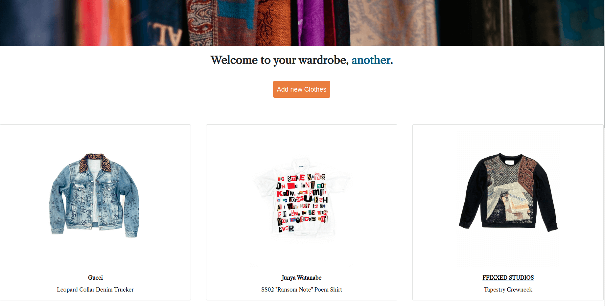

# Locked In Closets



<b>Url:</b> https://locked-in-closets.herokuapp.com

## Objective:
For those with too many clothes and shoes, remembering what clothes' one has can be quite a challenge. Thus having a digital database of your clothes can be very useful in seeing what one has. It can be used for planning outfits for various occasions and seasons.

## Functions:
It works as a CRUD(Create, read, update and delete) app with RESTful routes built upon the framework MVC using expressJS and NodeJS and PostgreSQL for database.

Users can submit a form to add their clothes into the database. For example, some of the form items are name, brand, colour, categories etc. Hence users can use it to organize and sort their clothing based on type, colour etc.

It also features user image upload for pictures of their own clothing. Cloudinary was also used for online image storage.

## Technologies Used:

* **Front-End**
  * React
  * HTML
  * CSS
  * Javascript
* **Back-End**
  * NodeJS
  * ExpressJS
* **Database**
  * PostgreSQL
* **Others**
  * Cloudinary
  
## Installation Instructions:
1. Installs all the dependencies of the project using </br>
```
npm install
```
2. Create the Postgres db for running on local </br>
```
createdb DATABASE_NAME -U USERNAME
```
3. Creates the tables neccessary to run this project </br>
```
psql -d DATABASE_NAME -U USERNAME -f tables.sql
```
4. Seed dummy data </br>
```
psql -d DATABASE_NAME -U USERNAME -f seed.sql
```
